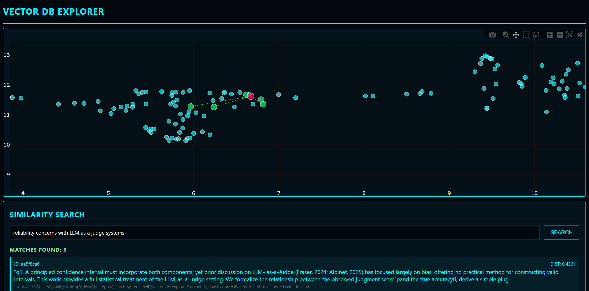
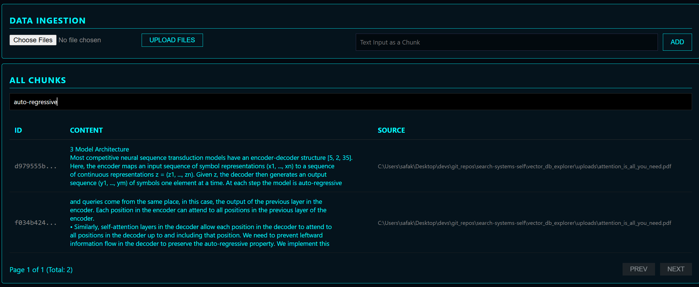

# Vector DB Explorer

A vector database instance with an interface to ingest data for chunking and embedding, plot vectors, and execute keyword-match or vector similarity searches.




## Directory Structure

- **`vector_db/`**: Core logic for the vector database, including the client, chunking, embedding, and storage (ChromaDB).
- **`vector_db_explorer/`**: A Flask web application that provides the user interface.
- **`msc/`**: Miscellaneous assets (images, etc.).

## Installation

1. Clone the repository.
2. Install dependencies:
   ```bash
   pip install -r requirements.txt
   ```

## Usage

1. Start the application:
   ```bash
   python vector_db_explorer/app.py
   ```
2. Open your browser and navigate to `http://localhost:5000`.


## Note
- This is a simple project I had fun building and mainly built to use the DB and client in my other projects. Feel free to use it anyway you want as the license allows.